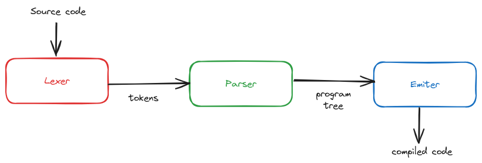

# TinyBASIC Compiler
TinyBASIC Compiler written in Go is a hobby project that was inspired by Austin Z. Henley 3 parts article ["Let's make a Teeny Tiny compiler"](https://austinhenley.com/blog/teenytinycompiler1.html).

## Main Idea
The main idea of this project is to create a compiler that can compile TinyBASIC code into C code and then compile it using GCC.

The program contains a lexer, parser, and code emitter. The lexer reads the input and tokenizes it. The parser reads the tokens and generates an abstract syntax tree (AST). The emitter reads the AST and generates C code.

## Technologies
- Go 1.22.5

## Usage
Project has Makefile with the following commands:
- `make build` - build the project
- `make run ARGS="path_to_bas_file path_to_c_file"` - run the project with the path to the bas file to compile and output c file as an arguments
- `make clean` - clean the project
- `make test` - run tests
- `make buildSamples` - build samples from the `samples` directory
- `make buildAndRunSamples` - build and run samples from the `samples` directory
- `make format` - format the code

## Examples
The `samples` directory contains some examples of TinyBASIC code that compiled version can be found in the `results` directory.